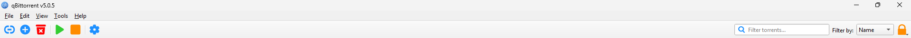
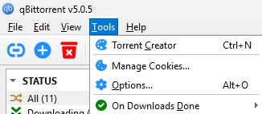
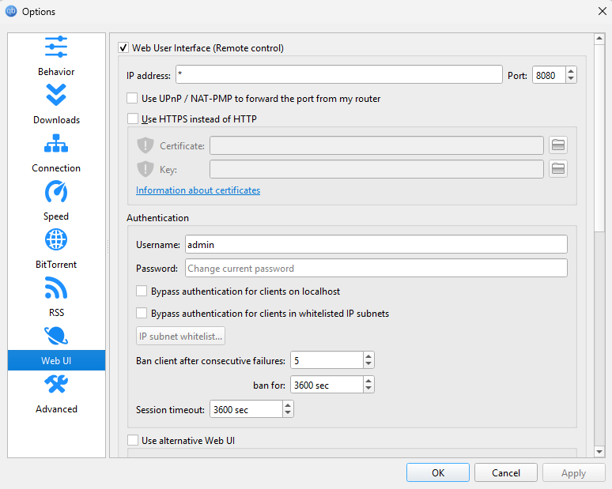

# qBittorrent Setup Guide

This guide will help you install and configure qBittorrent's Web UI for integration with this project.

## Step 1: Install qBittorrent

If you don’t already have qBittorrent installed, download it from the official website:

[**qBittorrent download**](https://www.qbittorrent.org/download)

Install the application following the instructions for your operating system.

## Step 2: Enable the Web UI

1. **Open qBittorrent**

Go ahead and open the app. 

Launch the application on your machine.

2. **Navigate to Web UI Settings**

- Go to `Tools` → `Options`



- Select `Options` from the dropdown menu



3. **Configure the Web UI**

- Go to the `Web UI` section.



- Tick the checkbox: “**Web User Interface (Remote control)**”

- Set the following values:
    - IP address: localhost (or another IP if needed)
    - Port: 8080 (default)
    - Username and Password: Set your credentials

4. **Save Settings**

Click `Apply` and then `OK` to save your changes.

## Step 3: Sync Configuration with `.env`

Update your .env file with the same values you set in the Web UI:

```bash
QBITTORRENT_HOST="localhost"        # default qBittorrent Web UI host
QBITTORRENT_PORT=8080               # default Web UI port
QBITTORRENT_USERNAME="admin"        # your qBittorrent username
QBITTORRENT_PASSWORD="adminadmin"   # your qBittorrent password     
```

> [!TIP]
> If you didn’t change anything and left the default settings, your `.env` file should look exactly like the example above.