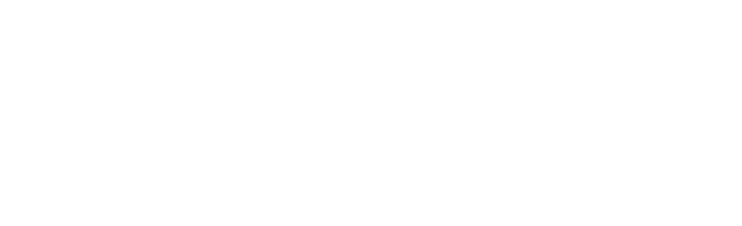

# Data Pipeline

## Torrent Web Scraper

This part focuses on scraping movie torrents from [**YTS.mx**](https://yts.mx/), a site hosting a large collection of movie torrents. For this demo, we narrowed our focus to films directed by **Quentin Tarantino**, because we’re big fans! You can view that subset here: [**YTS Quentin Tarantino Collection**](https://yts.mx/browse-movies/Quentin%20Tarantino)

### Packages and Setup

We used:

- `requests` - for HTTP requests
- `beautifulsoup4` - for HTML parsing

Since the YTS site uses **static HTML**, there was no need for tools like Selenium to handle JavaScript-rendered content.

### Page Layout & Scraping Strategy

Tarantino’s collection spans **3 pages**, each listing **20 movies** (or less for last page). Here's the high-level pipeline we followed:

1. **Extract Movie Links**

Each movie on the listing page is enclosed in a `
`. Inside, there’s an `<a>` tag linking to the individual movie page.

- We collected all such `<a>` tags to get the full list of movie URLs.

2. **Handle Pagination**

To access the next set of movies, we appended a page parameter (e.g., `?page=2`) to the URL. We continued incrementing this page number until no more movie links were found.

3. **Scrape Movie Details**

For each movie page, we extracted:

- **Title** – used to name the output file

- **Director** – used to ensure the movie was directed (not just written/produced) by Tarantino

- **Torrent file** – we selected the **first (lowest quality)** torrent for faster downloads

Each of these elements had unique class identifiers, making them easy to parse.

## Torrent Downloader

The [**qBittorrent**](https://www.qbittorrent.org/) app needs to be installed and running in background for the automated torrent downloader to work.

### qBittorrent Configuration

To allow programmatic control, the **Web UI** must be enabled with remote access permissions.

Refer to the full setup guide here: [**qBittorrent Setup**](./02_qbittorrent_setup.md)

### Downloading Process

We’ve created a wrapper class around the `qbittorrentapi` Python package that lets us:

- Connect to the qBittorrent client
- Add torrents to the download queue
- Pause or stop torrents
- Remove torrents
- Monitor download progress

This abstraction streamlines the automation of torrent downloads within the pipeline.

## Audio Extraction

We use the `ffmpeg` library to convert `.mkv` movie files into audio formats.

Currently supported audio output formats:

- `.wav`
- `.mp3`
- `.mka`
- `.aac`

This step allows for downstream audio-based processing.

## Subtitle Extraction

Subtitles are also extracted using `ffmpeg`, focusing on **English-language tracks** and specifically the **normal** subtitle type.

There are typically three subtitle types present:

- **normal** – standard dialogue subtitles

- **SDH** (Subtitles for the Deaf and Hard of Hearing) – includes background sounds, speaker IDs, etc.

- **forced** – shows only critical non-English dialogue or on-screen text

We extract only the normal subtitles for a cleaner transcript.

### Subtitle Text Cleaning

Once subtitles are extracted, we apply a text preprocessing pipeline to standardize the content:

- Remove HTML tags
- Replace leading hyphens (e.g., in dialogue lines)
- Normalize whitespace (e.g., multiple spaces → single space)
- Convert text to lowercase
- Split text into sentences using punctuation (`.`, `!`, `?`)
- Remove all punctuation except apostrophes
- Remove non-textual characters (e.g., music notes, symbols)

## Audio Segmenting

To prepare our data for machine learning, we need to split the full-length movie audio (typically 2–3 hours) into smaller, manageable segments, ideally **30 to 45** seconds of continuous speech paired with their corresponding subtitles.

We also aim to **remove silent or non-speech sections**, which are common and often lengthy.

### Approach

Since we already extracted subtitles with precise timestamps in a previous step, we can leverage this information to:

- Identify and isolate **spoken segments** only

- Extract continuous chunks of **30–45 seconds** of speech

- Discard parts with **no dialogue**, such as ambient noise or long pauses

This method ensures that our training data is focused, relevant, and aligned with textual context.

## Vocal Extraction

### Idea

Our goal was to use machine learning models to isolate **vocals** (spoken dialogue) from background audio in movies.

### Tools & Frameworks

We experimented with two popular vocal separation libraries:

- [**spleeter**](https://github.com/deezer/spleeter)

- [**demucs**](https://github.com/facebookresearch/demucs)

### Results

- [**Input Audio Sample**](../../data/samples/dazed_and_confused_sample.wav)

- [**Spleeter Output (5 stems)**](../../data/vocal_extraction/spleeter_5stems/dazed_and_confused_sample/vocals.wav)

- [**Demucs Output (5 stems)**](../../data/vocal_extraction/htdemucs_ft/dazed_and_confused_sample/vocals.wav)

While both models were able to isolate **singing vocals** from musical segments, they consistently failed to extract **spoken dialogue**, even in scenes with minimal background noise (e.g., just wind).

### Why It Didn't Work

These models are trained primarily on **music datasets**, where:

- Instruments have specific frequencies

- The source separation problem is more constrained

In contrast, movie audio is far more complex and varied:

- Dialogue is often mixed with background music, ambient noise, and sound effects

- No clear separation like that found in musical tracks

As a result, the models couldn't generalize to our use case. The **data distribution** was too different from their training data.

## Filtering

After segmenting, we applied a cleanup process to ensure that only meaningful audio-text pairs remained.

### Text Filtering

- Segments with **fewer than 15** words in the corresponding subtitle file were discarded.

- These usually lacked substantial dialogue and did not provide useful data for training.

### Audio Filtering

- `.wav` files shorter than **10 seconds** were also removed.

- These short clips often came from edge cases, such as the very beginning or end of a movie, and typically contained incomplete or irrelevant audio.

## Final Data Pipeline Graph

