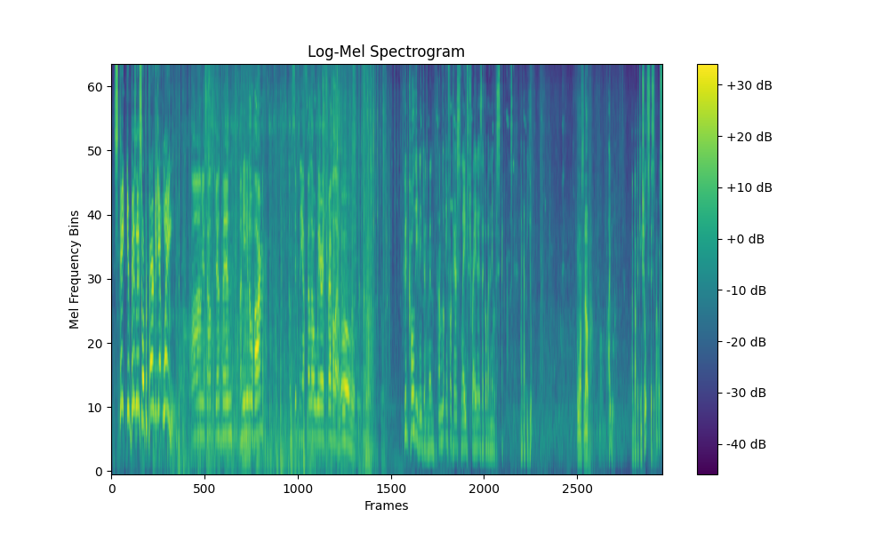
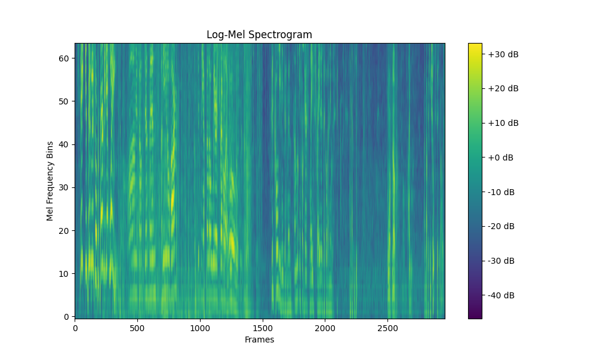

# Data Preprocessing

## Audio Preprocessing

Before training our machine learning models, we performed several preprocessing steps on the raw audio data. These steps ensured that our input was both standardized and optimized for speech recognition tasks.

We alredy started by filtering out audio clips with minimal dialogue, keeping only those with sufficient speech content. All audio samples were then trimmed or padded to exactly **30 seconds** in length to maintain consistency.

### Downmixing

Most audio files contain multiple channels (e.g., stereo). To simplify processing and reduce dimensionality, we **averaged the channels to convert them into mono audio**.

### Normalization

To standardize the amplitude across all samples, we **normalized the waveform values to the range** `[-1, 1]`. This helps prevent numerical instability and improves model convergence during training.

### Resampling

Speech signals predominantly lie below 8 kHz. Leveraging the [**Nyquist-Shannon Sampling Theorem**](https://en.wikipedia.org/wiki/Nyquist%E2%80%93Shannon_sampling_theorem), we **resampled all audio files to 16 kHz**, which is sufficient to capture the necessary information in human speech while reducing data size.

### Voice Frequency Filtering

We applied a **band-pass filter** to isolate **frequencies between 85 Hz and 3000 Hz**, which roughly corresponds to the range of human voice. This helps remove irrelevant noise and frequency content that doesn't contribute to speech recognition.

### Wiener Filtering

To reduce noise while preserving speech quality, we used the **Wiener filter**, which is widely known in speech recognition for its ability to balance noise reduction with minimal speech distortion. More aggressive noise suppression methods can distort speech, making it less useful for training.

> Learn more: [**Wikipedia Wiener Filter**](https://en.wikipedia.org/wiki/Wiener_filter)


### Log-Mel Spectrogram

We extracted **Log-Mel spectrograms**, a widely used feature representation in speech processing. This transformation offers several advantages:

- The **Mel scale** mimics the human ear’s sensitivity: we’re better at distinguishing lower frequencies than higher ones.

- The logarithm of the Mel spectrogram compresses the dynamic range of the signal. This reflects the human ear’s logarithmic perception of loudness and also reduces the impact of variations in speaking volume, making features more consistent.

### Visualization

Below are visual comparisons of the spectrograms at various stages of preprocessing:

#### Raw Log-Mel Spectogram



> Basic log-Mel spectrogram without any filtering.

#### After Voice Frequency Filtering



> Spectrogram after removing frequencies outside the voice range (85–3000 Hz).

#### After Voice Frequency Filtering + Wiener Filter


> Final spectrogram after applying both voice frequency filtering and the Wiener filter.

## Subtitle Preprocessing

As outlined in our [Data Pipeline – Subtitle Text Cleaning](./03_data_pipeline.md#subtitle-text-cleaning), subtitle text underwent several initial preprocessing steps:

- Removed HTML tags
- Replaced leading hyphens (e.g., in dialogue lines)
- Normalized whitespace (e.g., multiple spaces → single space)
- Converted text to lowercase
- Split text into sentences using punctuation (`.`, `!`, `?`)
- Removed all punctuation except apostrophes
- Removed non-textual characters (e.g., music notes, symbols)

### Tokenization & Embedding

After cleaning the text, we prepared it for use in our machine learning model, which, unlike humans, cannot interpret raw text. Instead, models work with **numerical representations** of words.

To achieve this, we used the `BertProcessor`, which performs:

- **Tokenization**: Splits text into subword units (WordPiece tokens)

- **Conversion to IDs**: Maps each token to its corresponding index in the BERT vocabulary

- **Padding/truncation**: Ensures all input sequences are the same length

- **Attention mask generation**: Helps the model distinguish between actual tokens and padding

These token IDs are then passed to a **BERT embedder**, which transforms them into dense vector representations suitable for input into our model.

This pipeline allows us to turn raw text into a structured, numerical format that deep learning models can understand and learn from.

This is how we managed to extract numbers for our strings.

### Example Output

```
Input text: 

"state your business or prepare to get winged
calm yourselves gentlemen
i mean you no harm
i'm simply a fellow weary traveler
whoa boy
good cold evening gentlemen
i'm looking for a pair of slave traders that go by the name of the speck brothers
might that be you
who wants to know
well i do
i'm dr
king schultz
this is my horse fritz"

Output Embeddings: 

Token		Embedding (first value):
==================================================
[CLS]        [-0.031426798552274704]
state        [0.5917357802391052]
your         [0.13955436646938324]
business     [0.2860156297683716]
or           [0.9503026008605957]
prepare      [0.47389867901802063]
to           [0.3284497857093811]
get          [-0.05316796153783798]
winged       [0.7143133878707886]
calm         [0.19899581372737885]
yourselves   [0.6593223214149475]
gentlemen    [0.2816689908504486]
i            [0.3056299388408661]
mean         [0.24220655858516693]
you          [-0.3945435583591461]
no           [-0.5192216038703918]
harm         [0.7450321912765503]
i            [0.2685508728027344]
'            [0.617261528968811]
m            [0.09049440175294876]
simply       [0.6742996573448181]
a            [-0.12972207367420197]
fellow       [0.4290388226509094]
weary        [0.681162416934967]
traveler     [0.5952596664428711]
whoa         [0.4856981039047241]
boy          [0.2714136838912964]
good         [0.26720595359802246]
cold         [0.16139085590839386]
evening      [0.07954594492912292]
gentlemen    [0.1783004105091095]
i            [0.21192319691181183]
'            [0.6087495684623718]
m            [0.16792258620262146]
looking      [-0.4277466833591461]
for          [0.019833602011203766]
a            [0.32258135080337524]
pair         [0.9017518758773804]
of           [0.08765321224927902]
slave        [1.3553224802017212]
traders      [0.7670890688896179]
that         [0.2582424283027649]
go           [0.6959033012390137]
by           [1.0501264333724976]
the          [0.06545021384954453]
name         [0.19647757709026337]
of           [-0.09283808618783951]
the          [0.3300958573818207]
spec         [0.587810218334198]
##k          [-0.6790321469306946]
brothers     [0.7171322107315063]
might        [0.8205792307853699]
that         [-0.1958954781293869]
be           [0.8499196171760559]
you          [-0.06269575655460358]
who          [-0.8409755825996399]
wants        [0.4454444944858551]
to           [0.5163993835449219]
know         [0.6243178248405457]
well         [0.8256926536560059]
i            [0.21154655516147614]
do           [0.26602211594581604]
i            [0.055003732442855835]
'            [0.6320239901542664]
m            [0.7231801748275757]
dr           [0.3433249294757843]
king         [0.4757535755634308]
schultz      [-0.026059262454509735]
this         [-0.19547556340694427]
is           [0.2445361316204071]
my           [0.5942360758781433]
horse        [0.4529430866241455]
fritz        [-0.25482046604156494]
[SEP]        [0.5356891751289368]
```