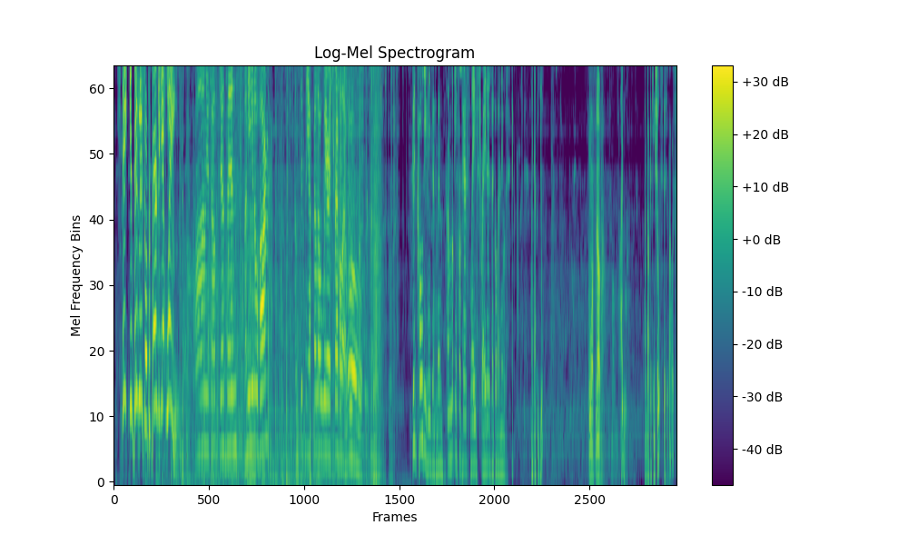

# Data Preprocessing

## Audio Preprocessing

Before training our machine learning models, we performed several preprocessing steps on the raw audio data. These steps ensured that our input was both standardized and optimized for speech recognition tasks.

We already started by filtering out audio clips with minimal dialogue, keeping only those with sufficient speech content. All audio samples were then trimmed or padded to exactly **30 seconds** in length to maintain consistency.

### Downmixing

Most audio files contain multiple channels (e.g., stereo). To simplify processing and reduce dimensionality, we **averaged the channels to convert them into mono audio**.

### Normalization

To standardize the amplitude across all samples, we **normalized the waveform values to the range** `[-1, 1]`. This helps prevent numerical instability and improves model convergence during training.

### Resampling

Speech signals predominantly lie below 8 kHz. Leveraging the [**Nyquist-Shannon Sampling Theorem**](https://en.wikipedia.org/wiki/Nyquist%E2%80%93Shannon_sampling_theorem), we **resampled all audio files to 16 kHz**, which is sufficient to capture the necessary information in human speech while reducing data size.

### Voice Frequency Filtering

We applied a **band-pass filter** to isolate **frequencies between 85 Hz and 3000 Hz**, which roughly corresponds to the range of human voice. This helps remove irrelevant noise and frequency content that doesn't contribute to speech recognition.

### Wiener Filtering

To reduce noise while preserving speech quality, we used the **Wiener filter**, which is widely known in speech recognition for its ability to balance noise reduction with minimal speech distortion. More aggressive noise suppression methods can distort speech, making it less useful for training.

> Learn more: [**Wikipedia Wiener Filter**](https://en.wikipedia.org/wiki/Wiener_filter)


### Log-Mel Spectrogram

We extracted **Log-Mel spectrograms**, a widely used feature representation in speech processing. This transformation offers several advantages:

- The **Mel scale** mimics the human ear’s sensitivity: we’re better at distinguishing lower frequencies than higher ones.

- The logarithm of the Mel spectrogram compresses the dynamic range of the signal. This reflects the human ear’s logarithmic perception of loudness and also reduces the impact of variations in speaking volume, making features more consistent.

### Visualization

Below are visual comparisons of the spectrograms at various stages of preprocessing:

#### Raw Log-Mel Spectogram


> Basic log-Mel spectrogram without any filtering.

#### After Voice Frequency Filtering


> Spectrogram after removing frequencies outside the voice range (85–3000 Hz).

#### After Voice Frequency Filtering + Wiener Filter



> Final spectrogram after applying both voice frequency filtering and the Wiener filter.

## Subtitle Preprocessing

As outlined in our [Data Pipeline – Subtitle Text Cleaning](./03_data_pipeline.md#subtitle-text-cleaning), subtitle text underwent several initial preprocessing steps:

- Removed HTML tags
- Replaced leading hyphens (e.g., in dialogue lines)
- Normalized whitespace (e.g., multiple spaces → single space)
- Converted text to lowercase
- Split text into sentences using punctuation (`.`, `!`, `?`)
- Removed all punctuation except apostrophes
- Removed non-textual characters (e.g., music notes, symbols)

### Tokenization

After cleaning the text, we prepared it for use in our machine learning model, which, unlike humans, cannot interpret raw text. Instead, models work with **numerical representations** of words.

To achieve this, we used the `BertProcessor`, which performs:

- **Tokenization**: Splits text into subword units (WordPiece tokens)

- **Conversion to IDs**: Maps each token to its corresponding index in the BERT vocabulary

This pipeline allows us to turn raw text into a structured, numerical format that deep learning models can understand and learn from.

This is how we managed to extract numbers for our strings.

### Example Output BertProcessor

```
Input text: 

"""state your business or prepare to get winged
calm yourselves gentlemen
i mean you no harm
i'm simply a fellow weary traveler
whoa boy
good cold evening gentlemen
i'm looking for a pair of slave traders that go by the name of the speck brothers
might that be you
who wants to know
well i do
i'm dr
king schultz
this is my horse fritz
"""

	BertProcessor
Vocab Size: 30522
Token		Token ID:
==================================================
[CLS]        101
state        2110
your         2115
business     2449
or           2030
prepare      7374
to           2000
get          2131
winged       14462
calm         5475
yourselves   25035
gentlemen    11218
i            1045
mean         2812
you          2017
no           2053
harm         7386
i            1045
'            1005
m            1049
simply       3432
a            1037
fellow       3507
weary        16040
traveler     20174
whoa         23281
boy          2879
good         2204
cold         3147
evening      3944
gentlemen    11218
i            1045
'            1005
m            1049
looking      2559
for          2005
a            1037
pair         3940
of           1997
slave        6658
traders      13066
that         2008
go           2175
by           2011
the          1996
name         2171
of           1997
the          1996
spec         28699
##k          2243
brothers     3428
might        2453
that         2008
be           2022
you          2017
who          2040
wants        4122
to           2000
know         2113
well         2092
i            1045
do           2079
i            1045
'            1005
m            1049
dr           2852
king         2332
schultz      22378
this         2023
is           2003
my           2026
horse        3586
fritz        12880
[SEP]        102
```

### Reducing Output Layer Size with Character-Based Tokenization

When using a typical tokenizer, token IDs can have very high values, often in the tens of thousands. 

This means that the final classification layer in a model (used to predict the next token) must match the full vocabulary size, leading to large and computationally expensive output layers.

To address this, we use **character-level tokenization** with **Wav2Vec2**, which has a much smaller vocabulary of only 32 tokens. 

This includes the 26 letters of the English alphabet and a few special characters such as `<pad>`, `<unk>`, and `|` (representing space or word boundary).

### Example Output Wav2Vec2TextProcessor

```
    Wav2Vec2 Processor
Vocab Size: 32
Token		Token ID:
==================================================
S            12
T            6
A            7
T            6
E            5
|            4
Y            22
O            8
U            16
R            13
|            4
B            24
U            16
S            12
I            10
N            9
E            5
S            12
S            12
|            4
O            8
R            13
|            4
P            23
R            13
E            5
P            23
A            7
R            13
E            5
|            4
T            6
O            8
|            4
G            21
E            5
T            6
|            4
W            18
I            10
N            9
G            21
E            5
D            14
```