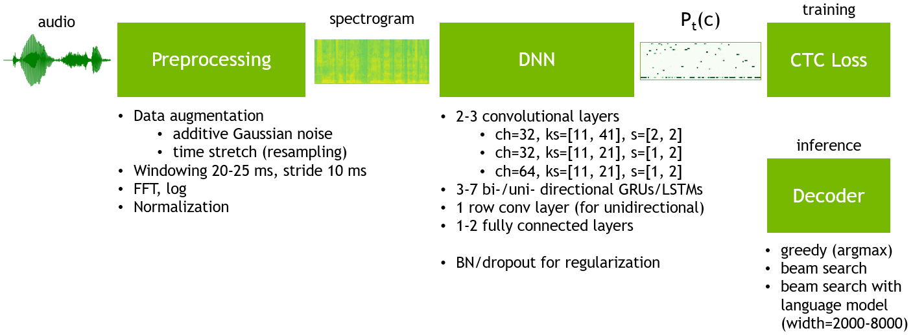
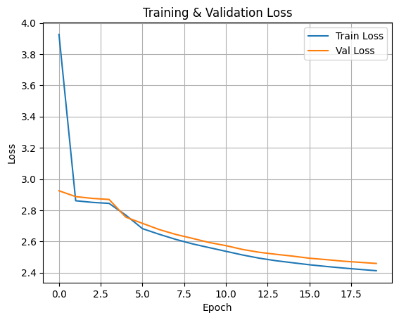

# DeepSpeech2 Model

Our model is a lightweight adaptation of NVIDIA's DeepSpeech2 designed to accommodate computational constraints, such as limited training time and hardware resources. This adaptation focuses on reducing the model’s complexity while maintaining reasonable accuracy, making it suitable for time-sensitive tasks like automatic movie subtitling.

---

## Dataset

The model was trained on the **LibriSpeech 100-hour dataset**, which contains diverse audio samples with corresponding text transcriptions. The dataset is well-suited for training speech-to-text models, offering a balance of high-quality audio and linguistic variety.

* **Training Duration**: 8 hours.
* **Number of Epochs**: 20 epochs.
* **Input Handling**: The custom collate function dynamically handles varying input lengths by padding sequences and labels. This ensures compatibility with the model's architecture.

---

## Model Architecture

> Learn more: [NVIDIA DeepSpeech2](https://nvidia.github.io/OpenSeq2Seq/html/speech-recognition/deepspeech2.html)

Our model simplifies the DeepSpeech2 framework by reducing computational overhead. Below is the description of the neural network's configuration:

### Convolutional Layers

1. **First Layer**:

   * 16 filters.
   * Kernel size: (11, 21).
   * Stride: (2, 2).
   * Padding: (5, 10).

2. **Second Layer**:

   * 32 filters.
   * Kernel size: (11, 11).
   * Stride: (1, 1).
   * Padding: (5, 5).

These layers extract features from spectrograms, reducing their dimensionality and highlighting patterns relevant to speech recognition.

### Recurrent Layer

A **bi-directional LSTM** with the following configuration:

* Input size: 32 \* 101 (post-convolution).
* Hidden size: 128.
* Number of layers: 2.
* Bidirectionality enables the model to capture context from both past and future frames.

### Fully Connected Layer

The LSTM output feeds into a fully connected layer:

* Input size: 256 (128 per direction).
* Output size: 32 (number of output classes).

### Output

The final layer outputs probability distributions for character classes, suitable for connectionist temporal classification (CTC) loss.

### Training Configuration

* **Loss Function**: Connectionist Temporal Classification (CTC) Loss

  * Optimized for variable-length input and output sequences.
  * Configured with a blank token (class 0) and `zero_infinity=True` for numerical stability.
* **Optimizer**: Adam with a learning rate of 1e-5.

---

## Preprocessing

Dedicated readme for preprocessing: [Data Preprocessing](04_data_preprocessing.md).

---

## Results

### Training and Validation Loss

The training and validation loss steadily decreased over 20 epochs:

### Loss Progression

| Epoch | Train Loss | Validation Loss |
| ----- | ---------- | --------------- |
| 1/20  | 3.9261     | 2.9246          |
| 2/20  | 2.8608     | 2.8873          |
| 3/20  | 2.8504     | 2.8759          |
| 4/20  | 2.8439     | 2.8691          |
| ...   | ...        | ...             |
| 20/20 | 2.4127     | 2.4593          |

### Test Results

The model was evaluated on five 30-second audio clips from the movie *Once Upon a Time in Hollywood*. The results demonstrate the model’s ability to process audio and generate text predictions. However, there are significant discrepancies between the predictions and the ground truth.

#### Example: Output Comparison

| **Reference**                                                                                                           | **Prediction**                                                                                            |
| ----------------------------------------------------------------------------------------------------------------------- | --------------------------------------------------------------------------------------------------------- |
| *about to get his jaw busted grunts amateurs try and take men in alive all grunt amateurs usually don't make it...*     | *O A A AN A IN E OO A O E AR  AENINNIN EAIN AN O EE E A EN E E A A AN O E AIN A AN  A A A INA A AN EN...* |
| *growls peggy on tv i waited at the bar till closing time but he never came back man on tv okay peggy what happened...* | *EEOE E AE ANN  E AEN E TEEN  A  O  OAN  E E A  E ENE EI EE  E  O TEA SA I  E EI  E  E AI A E SO A...*    |
| *i got my book say say where's the badguy saloon you just go straight through the western town take a right...*         | *EE E E O E  SO A   O TEO PO TE A  TE E A SO TE PO TO COR SO TEE E TEA EE TE O A  O COAN   A SOO...*      |
| *you the mama bear can i help you i hope so i'm an old friend of george's thought i'd stop and say hello...*            | *A A TE O AN A SAII  TO E A  TE EE A  TOE  OE ORIN  E E A O EAN IN TEE O A E E E TOO  O EA TEI...*        |
| *how'd your little talk with george go are we kidnapping him not the word i'd use now you've talked to him...*          | *E E EE E O O  O E E E A  HE O EE AAN  OI A E E A E EA  A  O A  A E O A E E A  TEEA E AN ANIN...*         |

The model’s predictions lack coherence, due to insufficient training time and reduced complexity.

---

## Conclusion

FasterDeepSpeech2 provides a streamlined speech-to-text model capable of operating under tight computational constraints. While it demonstrates potential for automatic movie subtitling, the output quality suggests that:

1. Extended training time and dataset size could improve performance.
2. Further refinement of the architecture may balance efficiency and accuracy.

