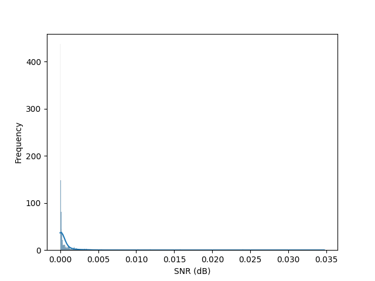
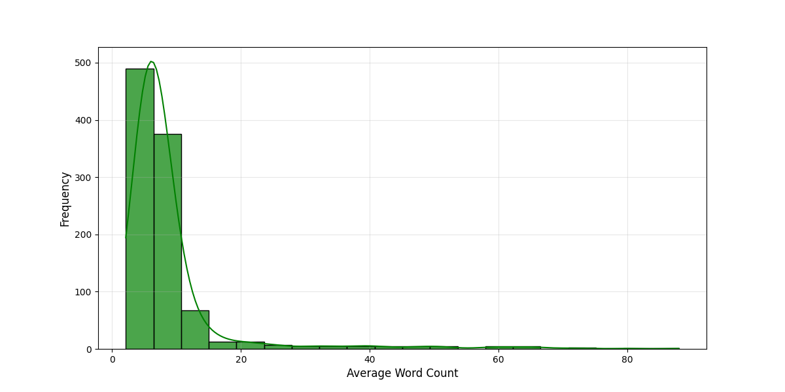
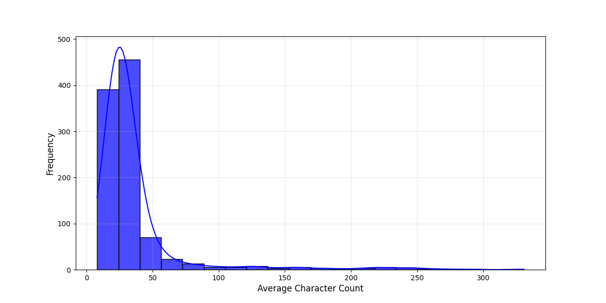
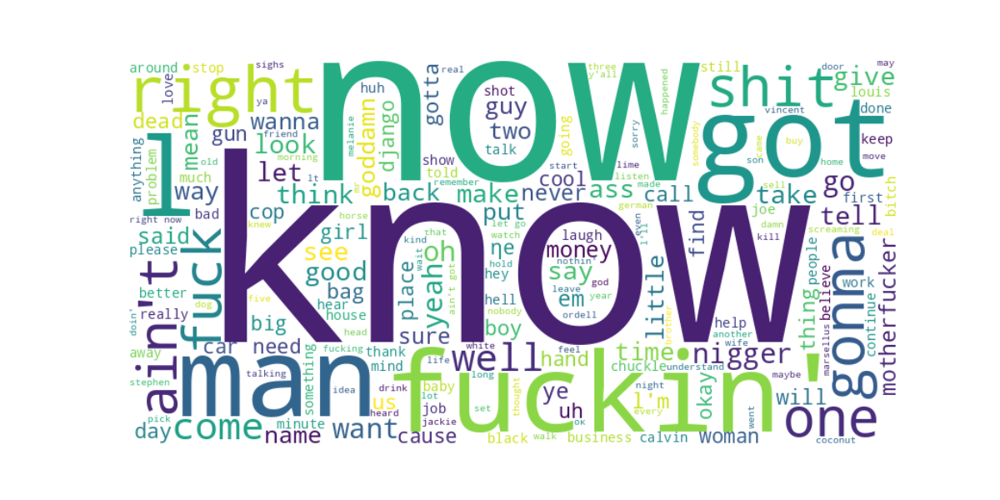

# Exploratory Data Analysis (EDA)

This section summarizes the exploratory data analysis performed on movie2sub dataset containing audio files and subtitles, extracted from Quentin Tarantino's movies. The goal of this analysis is to understand the structure and properties of the data to inform subsequent processing and modeling.

---

## Methods

We conducted the following analyses:
- Audio Analysis:
  - Computed Signal-to-Noise Ratio (SNR) for evaluating audio clarity.
  - Performed Fast Fourier Transform (FFT) to examine frequency components.
  - Analyzed energy distribution across frames to observe dynamics in the audio signal.
- Subtitle Analysis:
  - Calculated average character and word counts per subtitle segment.
  - Visualized the distributions of these counts to identify patterns.

---

## Findings
### Signal-to-Noise Ratio (SNR)

For Signal to Noise Ratio distribution we used the following formula:
$$
\text{SNR (dB)} = 10 \cdot \log_{10}\left(\frac{P_{\text{signal}}}{P_{\text{noise}}}\right)
$$

The SNR values appear to be heavily skewed towards the lower range (close to 0). This indicates that the majority of the audio samples in the dataset have relatively low SNR, potentially implying that the audio is noisy.

### Fast Fourier Transform (FFT)

Examining the FFT shows a trend towards lower frequencies. To get a clearer view, lets examine the output for ``segment_000269`` from **Pulp Fiction**:

The dominant energy in the lower frequencies indicates that this audio segment may include bass tones, vocal dialogue, or ambient low-frequency sounds, typical of movie soundtracks or scenes with spoken lines. The diminishing magnitude at higher frequencies might suggest that the segment lacks high-pitched sounds or that these frequencies were attenuated during recording or post-processing.

### Energy Distribution

There are a few trends that can be observed in our data sets that can provide a general picture of Tarantino's directing style. While this is beyond our scope, it would have been a shame not to at least evaluate our previous example (``segment_000269``).

Significant peaks are observed at around the **15-second** mark. This indicates bursts of energy, which could correspond to loud events, such as dialogue, music, or sound effects in the audio segment. There is this noticeable drop in energy between the two peaks. A point where the energy drops to about 0 for about 2 seconds. This would imply a point of tension for the audience.

### The average word/character count

 

The analysis shows that most batches contain less than ``20 words`` or ``100 characters``.

### Word Cloud

_Interesting thing, isn't it?_ We'll leave it to the reader to interpret the word cloud.