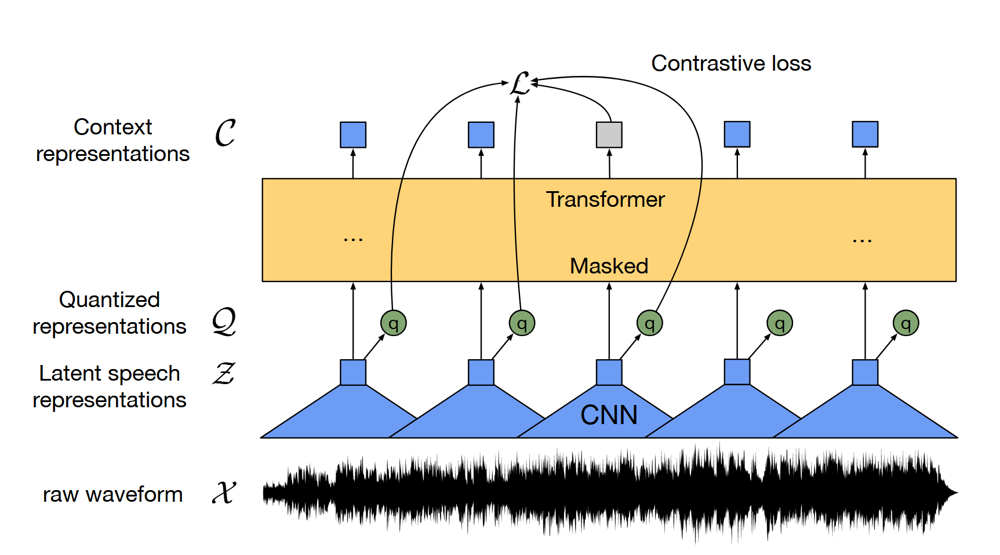
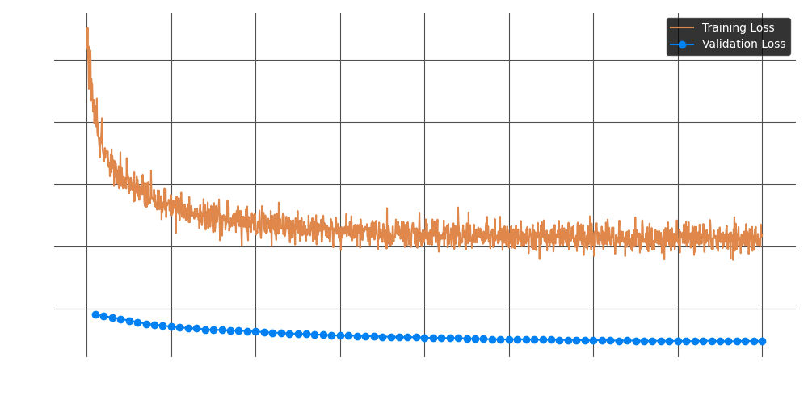

# Wav2Vec2

This module fine-tunes Facebook's `Wav2Vec2` model for automatic speech recognition (ASR) using movie subtitles. The model learns to map raw audio waveforms to transcribed text using self-supervised representations and Connectionist Temporal Classification (CTC) loss.

## Motivation

Wav2Vec2 provides strong performance in low-resource ASR tasks by leveraging unsupervised pretraining on raw audio. Our motivation is to adapt it to real-world, noisy movie dialogue, which includes diverse acoustic conditions such as music, overlapping speech, and varying audio quality.

## Architecture


> Illustration of Wav2Vec2 framework which jointly learns contextualized speech representations
and an inventory of discretized speech units.

### Feature Encoder

The feature encoder consists of a series of temporal convolutional layers, each followed by:

- **Layer Normalization**
- **GELU Activation**

### Contextualized representations with Transformers

The encoder outputs are passed through a **contextual network** built on the Transformer architecture. Instead of fixed positional encodings, Wav2Vec2 uses a convolutional layer for **relative positional information**, followed by:

- **GELU Activation**
- **Layer Normalization**

### Quantization Module

For self-supervised pretraining, the model discretizes encoder outputs `z` into a finite vocabulary of speech units using **product quantization**. These are compared with predictions from the Transformer to compute contrastive loss.

## Preprocessing

We used the built-in Wav2Vec2 processor from Hugging Face for audio and text preprocessing.

### Audio Preprocessing Steps

The following were done before feeding into Wav2Vec2 processor.

- **Downmixing**: Stereo audio is converted to mono by averaging channels.
- **Normalization**: Waveforms are scaled to the range `[-1, 1]` to stabilize training.
- **Resampling**: All audio is resampled to **16 kHz**, per the [Nyquist-Shannon Theorem](https://en.wikipedia.org/wiki/Nyquist%E2%80%93Shannon_sampling_theorem), to preserve speech information while reducing data size.

### Subtitle Preprocessing

- Spaces `" "` are replaced with `"|"` to mark word boundaries.
- Newlines (`"\n"`) are removed.
- All text is converted to **uppercase**.

## Training Setup

Training was conducted using Hugging Face's `Trainer` API.

### Model: 

```python
model = Wav2Vec2ForCTC.from_pretrained(
    "facebook/wav2vec2-base-960h",
    vocab_size=len(processor.tokenizer), # 32 in this case
    ctc_loss_reduction="mean",
    pad_token_id=processor.tokenizer.pad_token_id,
    ctc_zero_infinity=True, # zeroes infinite losses
)
```

### Data Collator

We implemented a custom collator to:

- Pad audio inputs
- Pad text token IDs and replace padding tokens with `-100` (to ignore in loss)


### Training Args

```python
output_dir="./wav2vec2-finetuned-moviesubs",
group_by_length=True,
dataloader_num_workers=4,
per_device_train_batch_size=2,
eval_strategy="epoch",
save_strategy="epoch",
load_best_model_at_end=True,
num_train_epochs=80,
fp16=False,
learning_rate=1e-7,
logging_strategy="steps",
logging_dir="./logs",
logging_steps=10,
report_to="none",
save_total_limit=1,
remove_unused_columns=False,
max_grad_norm=0.05,
```

- **Batch size = 2** due to GPU memory constraints.
- **Learning rate = 1e-7** to mitigate instability during fine-tuning.
- **Gradient clipping** (max_grad_norm = 0.05) to prevent exploding gradients.
- **fp16 disabled** due to numerical instability.
- **Early stopping** was included (but not used in the 80-epoch run).

### Trainer

```python
trainer = Trainer(
    model=model,
    args=training_args,
    train_dataset=dataset["train"],
    eval_dataset=dataset["test"],
    tokenizer=processor,
    data_collator=data_collator,
    compute_metrics=wrapped_compute_metrics,
    callbacks=[EarlyStoppingCallback(early_stopping_patience=10)],
)
```

The model improved from:

- Validation Loss: 1.9520 → 1.7371
- WER (Word Error Rate): 0.6464 → 0.6132

## Loss Curves



Both training and validation loss decrease together, indicating successful learning. Training loss stabilizes around **2.5**, and validation around **1.7**.

## Predictions

### Test Data

The test set consists of **five hand-picked audio segments** from *Once Upon a Time in Hollywood (2019)*, directed by Quentin Tarantino. These samples were selected to represent a variety of real-world challenges for speech recognition systems, including:

- **Multiple speakers** with distinct voices and accents
- **Background noise** such as music, ambient sounds, and crowd noise
- **Variability in audio quality**, volume, and clarity

This diverse selection provides a meaningful benchmark for evaluating the model’s robustness under noisy, multi-speaker, and acoustically complex conditions.

📁 **Access the test data here:** [**test**](../../data/test/)

### segment_000200.wav

Context: Screaming woman in background, two speakers.

**Ground Truth**:

```
HOW'D YOUR LITTLE TALK WITH GEORGE GO ARE WE KIDNAPPING HIM NOT THE WORD I'D USE NOW YOU'VE TALKED TO HIM YOU BELIEVE EVERYTHING'S ALL RIGHT NOT EXACTLY THIS WAS A MISTAKE YOU SHOULD LEAVE WAY AHEAD OF YOU GEORGE ISN'T BLIND YOU'RE THE BLIND ONE GIRLS YELLING INDISTINCTLY
```

**Prediction**:

```
HAV YOUR LITTLE TALK WITH GEORGE TO GO AR WE KID NAPPINGHAM NOT THE WORD I'D USE WELL NOW THT YOU'VE TALKD TOHOME DO YOU BELIEVE EVERYTHING'S ALL RIGHT NOT EXACTLY THIS WAS A MISTAKE YOU SHOULD LEAVE WHER  GEORGE AND BLIND GER BLIND BLIND
```

**WER**:  `0.4285`

**CER**:  `0.2867`

#### segment_000184.wav

Context: Clean audio, good volume.

**Ground Truth**:

```
YOU THE MAMA BEAR CAN I HELP YOU I HOPE SO I'M AN OLD FRIEND OF GEORGE'S THOUGHT I'D STOP AND SAY HELLO THAT'S VERY NICE OF YOU BUT YOU PICKED THE WRONG TIME GEORGE IS TAKING A NAP RIGHT NOW OH THAT IS UNFORTUNATE YES IT IS WHAT'S YOUR NAME CLIFF BOOTH HOW DO YOU KNOW GEORGE I USED TO SHOOT WESTERNS HERE AT THE RANCH WHEN WAS THE LAST TIME YOU SAW GEORGE
```

**Prediction**:

```
MAMA BEAR CAN I HELPE YOU I HOPE SO I'M AN OLD FRIEND OF GEORGES THOUGHT I STOP SAY HALLO IT'S VERY NICE OF YOU BUT UNFORTUNATELY PICKED O THE WRONG TIME GEORGE'S TAKING A MAN BYTO OH THAT IS UNFORTUYES ITIS WHAT'S YOUR NAME CLIFF BOT HAD HE KNOW GEORGE I USED TO SHOT WESTRN SHEERE AT THE RANDAGE WHEN I WAS LAST TIME YOU SAW A GEORGE
```

**WER**:  `0.4000`

**CER**:  `0.2134`

#### segment_000047.wav

Context: Minimal background noise, low volume.

**Ground Truth**:

```
GROWLS PEGGY ON TV I WAITED AT THE BAR TILL CLOSING TIME BUT HE NEVER CAME BACK MAN ON TV OKAY PEGGY WHAT HAPPENED PEGGY I DON'T KNOW EVERYTHING WAS FINE WE HAD DINNER AT MY HOUSE AND AFTERWARDS YOU KNOW WHILE I WAS DOING THE DISHES TSK TSK WHINES HE AND TOBEY PLAYED AND THEN AT THE CLUB GABE WAS DOING GREAT THEN WHAM A SUDDEN CHANGE YOU KNOW HOW MUSICIANS ARE THEY'RE TEMPERAMENTAL CATS WHO KNOWS WHAT GOT INTO HIM YEAH
```

**Prediction**:

```
H  WIS  OTO LOSING TIME HOU NEVER CAME BACK YOUR KIT JAGI WA I DON'T KNOW EVERYTHING WAS FINE  O AND AFTER IT'S DOT YOUNG WHILE I DOING THE DISHESYE   DHE WAS N RA AND WE SUDDEN CHANGE YOU KNOW HOW MUSICIANS EITHER TEMPERAMENTAL CATS WHO KNOWS WHAT GOT INTO O
```

**WER**:  `0.6626`

**CER**:  `0.4644`

#### segment_000096.wav

Context: Powerful background noise.

**Ground Truth**:

```
I GOT MY BOOK SAY SAY WHERE'S THE BADGUY SALOON YOU JUST GO STRAIGHT THROUGH THE WESTERN TOWN TAKE A RIGHT AND A LEFT AND YOU SEE IT RIGHT THERE THANKS HONEY CLEARS THROAT MAN <unk> CAN WE MOVE TO NUMBER TWO MAN <unk> HOW IS HIS BOUNCE MAN <unk> CAN I GET A BOUNCE THERE MAN <unk> JUST GRAB THE CRESCENT WRENCH COME RIGHT BACK JUST MAKE IT A QUICK ONE TIM MAN <unk> LOOKS GREAT RIGHT THERE
```

**Prediction**:

```
AGAG I'M A BUY SAY SAY WHERE'S A BAD GODS ALONE HE JUST GO STRAIGHT TO THE WESTERN TOWN TAKE A RIGHT AND A LEFT AND YOU SEE IT RIGHT THERE AKS HUNNY  AN A U  CURE OWE  LIKE A AI ER
```

**WER**:  `0.7215`

**CER**:  `0.6066`

#### segment_0000001.wav

Context: Two male speakers, background music.

**Ground Truth**:

```
ABOUT TO GET HIS JAW BUSTED GRUNTS AMATEURS TRY AND TAKE MEN IN ALIVE ALL GRUNT AMATEURS USUALLY DON'T MAKE IT ANNOUNCER WHETHER YOU'RE DEAD OR ALIVE YOU'RE JUST A DOLLAR SIGN TO JAKE CAHILL ON BOUNTY LAW THURSDAYS AT <unk><unk><unk> ONLY ON NBC NBC THEME PLAYS HELLO EVERYBODY THIS IS ALLEN KINCADE ON THE SET OF THE EXCITING HIT NBC AND SCREEN GEMS TELEVISION SERIES BOUNTY LAW
```

**Prediction**:

```
IT IS JUMUS O AMATEUR'S TRYIND TAKE MEN IN ALIVE  A AMATEURS USUALLY DON'T MAKE IT WHETHER YOU'RE DEAD OR ALIVE YOU'RE JUST DO DOLLAR SIGN TO CAKE CAKE LAW N SHOTY LAW THURSDAY SURDAY THIRTY ONLY ON N B C HELLOW EVERYBODY TIS AS ALLAN CHIN KADE ON THE SET OF THE EXCITING HIT N B C AND SCREEN GEM STELLIVISION SERIES BOUTY LAW
```

**WER**:  `0.5588`

**CER**:  `0.2849`

**AVERAGE WER**: `0.5543`

**AVERAGE CER**: `0.3713`